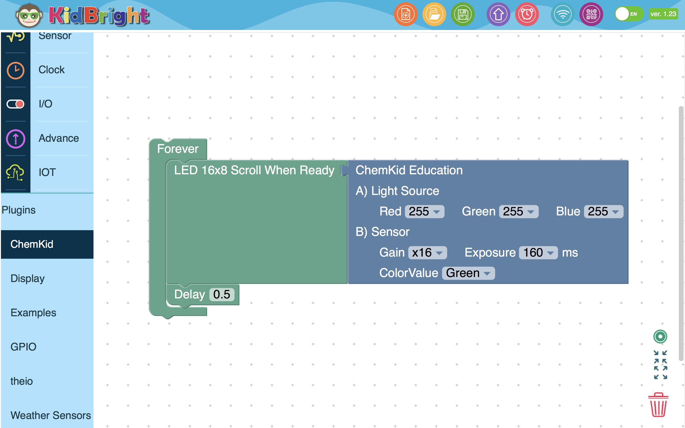

# ChemKid Plugins
*Photonics Technology Laboratory (PHT), NECTEC, NSTDA, THAILAND*
*Version: 1.03*
*Updated: 2019-01-12*
*By: Armote Somboonkaew*
*Contact: armote@nectec.or.th*

### การเริ่มต้นใช้งานซอฟต์แวร์โมดูล Plugins และฮาร์ดแวร์เครื่องอ่านสีสารละลาย ChemKid เพื่อการศึกษาทางเคมีและอื่นๆ
**การเตรียมซอฟต์แวร์**
- ติดตั้ง KidBright IDE (NEW UI, 64 bit)
- เปิดโปรแกรม KidBright IDE
- เลือก Plugins ที่แถบเครื่องมือด้านซ้ายแล้วนำ ChemKid ไปวางในพื้นที่ที่ใช้เขียนโปรแกรม
- โปรแกรมโดยใช้ Block ต่างๆ ใน KidBright IDE มาร่วมเชื่อมต่อกันเป็นการประยุกต์ต่างๆ ได้ตามต้องการ

**การเตรียมฮาร์ดแวร์**
- เริ่มเชื่อมต่อสาย I2C Chain ของบอร์ด KidBright เข้ากับฮาร์ดแวร์เครื่องอ่านสีสารละลาย ChemKid
- จ่ายไฟเลี้ยงเข้าบอร์ด KidBright แล้ว Upload โปรแกรมที่เขียนไว้ก็จะได้การทำงานต่างๆ ตามต้องการ
- หากโปรแกรมไม่สามารถทำงานได้ ตรวจสอบความถูกต้องของโปรแกรม และการเชื่อมต่ออีกครั้ง เบื้องต้นนั้นให้ทดสอบโดยเขียนโปรแกรมง่ายๆ ก่อน โดยใช้ ChemKid Plugins ประกอบเข้ากับการวนลูปด้วย Forever และการแสดงผลด้วย LED16x8 Scroll when Ready เพื่อทดสอบว่า Light Source ที่เป็น LED นั้นสามารถควบคุมให้สว่างหรือมืดเป็นสีที่ต้องการได้หรือไม่ ทั้งในส่วน Sensor ก็เช่นกัน ให้ดูว่าสามารถอ่านค่ามาแสดงผลได้หรือไม่ หากทั้งสองส่วนสามารถควบคุมได้และมีค่าส่งกลับมา ก็แสดงว่ามีการทำงานเบื้องต้นที่สมบูรณ์

### ภาพระบบโดยรวมของ ChemKid

### ชิ้นส่วนอิเล็กทรอนิกส์โมดูลภายใน ChemKid
| ชนิดของ Device         |  ชื่อโมดูล/ผู้ขายผู้ผลิต                  | Connect to |
|-----------------|----------------------|----------|
|  Light Source (RGB) | Gerora/Gravitec                 | CHAIN_SDA_GPIO |
|  Sensor (RGB)         | RGB Sensor Chain/Gravitec | KidBright's I2C Chain |

### การตั้งค่าพารามิเตอร์ ของ ChemKid Plugins
**A) Light resource:** ส่วนการควบคุมความเข้มแสงของแหล่งกำเนิดแสงชนิด RGB LED
- **Red** คือ ค่าความสว่างของสีแดง 		มีค่าได้ตั้งแต่ 0 ถึง 255
- **Green** คือ ค่าความสว่างของสีเขียว   มีค่าได้ตั้งแต่ 0 ถึง 255
- **Blue** คือ ค่าความสว่างของสีน้ำเงิน	มีค่าได้ตั้งแต่ 0 ถึง 255

**B) Sensor:** ส่วนการควบคุมความไวแสงของ RGB Sensor
- **Gain** คือ ค่าอัตราการขยายสัญญาณ มีค่าให้เลือก 1, 2 และ 16 เท่า ใช้ค่าที่สูงขึ้นเมื่อแสงมีปริมาณน้อย
- **Exposure** คือ ค่าเวลาในการเปิด Sensor ให้รับแสงนานเท่าใด รุ่นนี้มีค่าให้เลือก 160, 320 และ 640 มิลลิวินาที ใช้ค่าที่นานขึ้นเมื่อแสงมีปริมาณน้อย
- **Color Value** คือ ค่าผลลัพธ์ของสีที่ต้องการเพื่อนำไปคำนวณต่อถัดจากส่วน Plugins นี้ มีให้เลือก คือ Red, Green, Blue และ White เลือกใช้ให้เหมาะสมกับสีของตัวอย่างที่ต้องการตรวจวัด

### ภาพตัวอย่างโปรแกรมของการใช้ ChemKid Plugins แบบเบื้องต้น

####หมายเหตุ: ตัวอย่างการนำ ChemKid ไปประยุกต์ใช้งานทางด้านการศึกษาวิชาเคมีและอื่นๆ จะได้เพิ่มเติมในรายละเอียดต่างๆ ต่อไป
